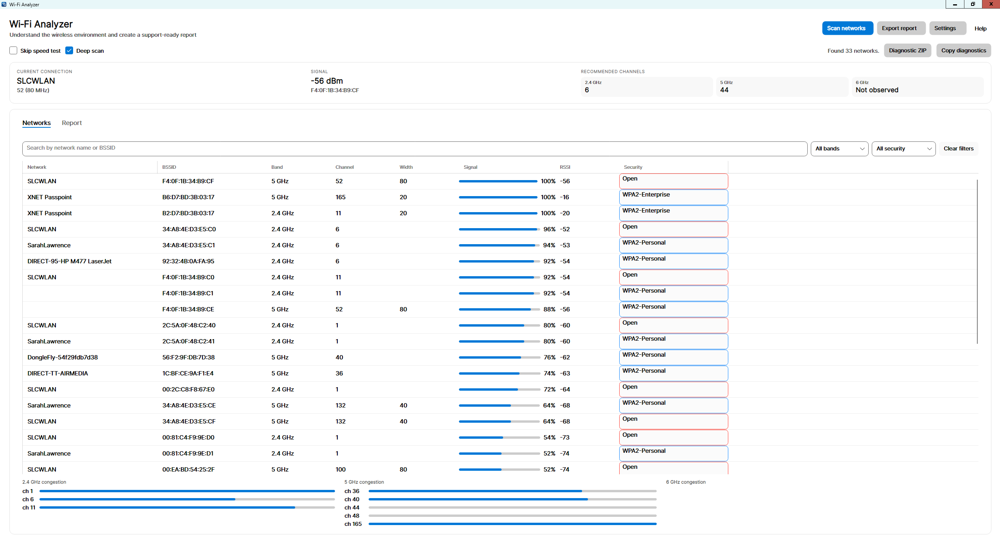
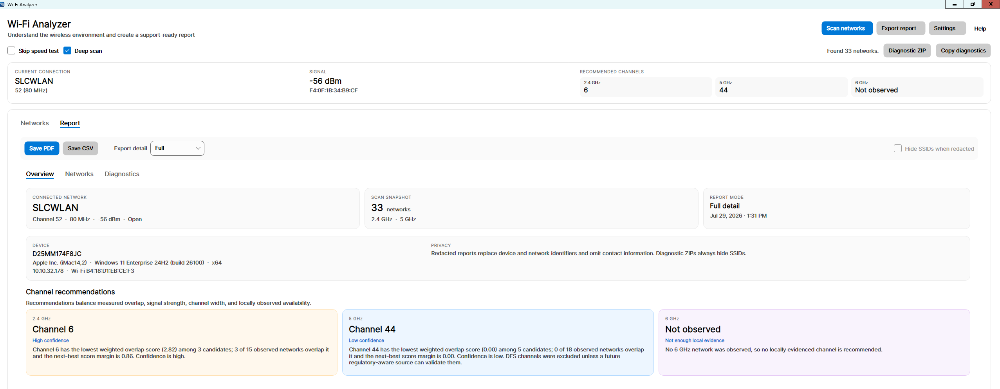
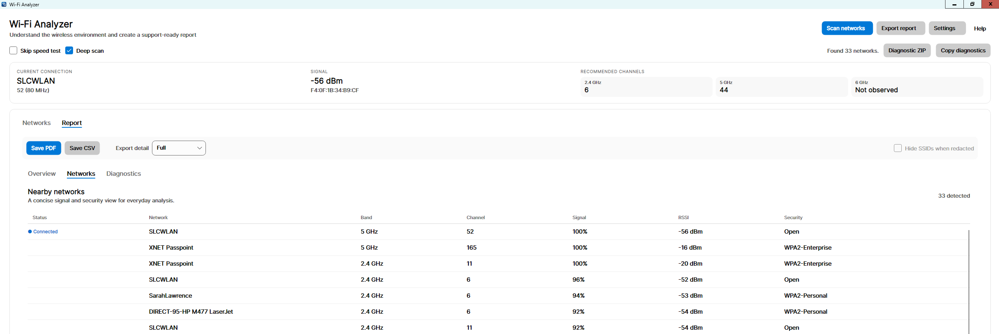
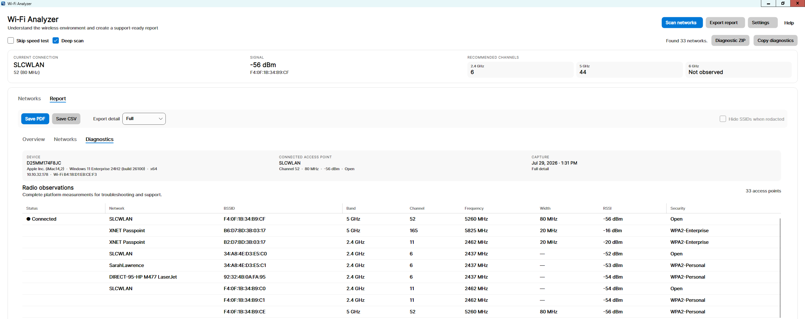
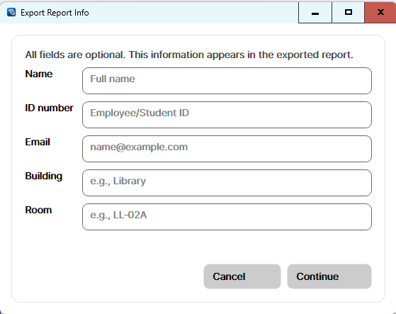
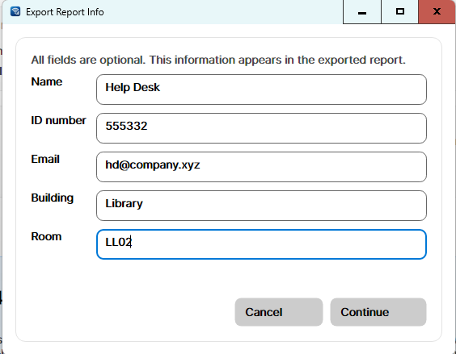
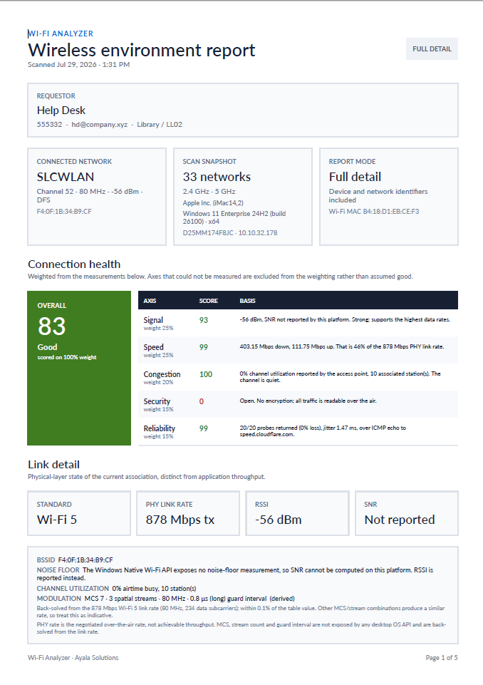

# Wi‑Fi Analyzer

Wi‑Fi Analyzer is a cross-platform desktop application for examining the local
wireless environment and producing support-ready reports for IT. It is built
with Avalonia and .NET 8.

Version: **2.4.0**



## What it does

- Scans nearby 2.4, 5, and observed 6 GHz access points.
- Identifies the connected access point when the platform supplies its BSSID.
- Shows signal, RSSI, channel, width, frequency, security, and band data.
- Recommends channels using measured overlap and signal strength, with
  confidence and a plain-language rationale.
- Runs a speed test after a scan by default, including packet loss and jitter.
- Creates structured PDF reports, network-focused CSV exports, plain-text
  diagnostics, and always-redacted diagnostic ZIPs.
- Captures support-relevant computer information with each scan:
  computer model, operating-system version/build, architecture, hostname, IP
  address, and Wi-Fi interface address.

### Link and radio engineering detail

- Reports the negotiated PHY transmit/receive link rate, distinct from
  application throughput.
- Identifies each access point's standard — Wi-Fi 4/5/6/6E/7 — from the
  capabilities it advertises in its beacon.
- Reports the noise floor and SNR where the platform measures them, and states
  plainly where it does not.
- Reports the MCS index, spatial-stream count, channel width, and guard
  interval, labelled according to whether the operating system reported them or
  they were derived from the link rate.
- Reports measured channel utilization — the percentage of airtime the medium
  was busy — from each access point's BSS Load element, alongside the
  overlap-based congestion scores.
- Lists roaming candidates for the connected SSID with their signal delta
  against the current association, and the 802.11k/v/r features advertised.
- Flags DFS channel use and explains, from the local scan, what selecting one
  costs and whether the measured congestion justifies it.
- Scores connection health from 0 to 100 across Signal, Speed, Congestion,
  Security, and Reliability, showing the measurement behind each axis.

Values that could not be measured are reported as unmeasured. They are excluded
from the health weighting rather than assumed good, and a score built on less
than half the weighting is labelled provisional.

## Measurement sources by platform

Capability differs by operating system. The report always states which applies,
so a derived value is never mistaken for a driver reading.

| Detail | Windows | macOS | Linux |
|---|---|---|---|
| PHY link rate | Reported (tx and rx) | Reported (tx) | Reported (tx and rx) |
| Noise floor and SNR | Not exposed by the OS | Reported | Reported when the driver publishes it |
| MCS, streams, guard interval | Derived from the link rate | Derived from the link rate | Reported by `iw` |
| Standard, utilization, 11k/v/r | Decoded from beacon elements | Standard only | Standard only |

## Supported platforms

| Platform | Scanner | Requirements |
|---|---|---|
| Windows 10/11, including Home | Native Wi-Fi API with `netsh` fallback | WLAN AutoConfig, an enabled Wi-Fi adapter, and location access for scan results |
| macOS 11 or later | CoreWLAN with structured `system_profiler` fallback | Wi-Fi and Location Services permission |
| Linux | `nmcli`, with `iw` for link detail | NetworkManager and permission to query Wi-Fi |

The workflow is the same across platforms, while fonts, controls, window
chrome, and permission prompts follow the host operating system.

## Using the application

Deep scan and the speed test are enabled by default. “Skip speed test” is
therefore unchecked on first launch.

1. Select **Scan networks**.
2. Follow the dedicated scan-status panel; it is kept above the data workspace
   and never overlays a network list.
3. Use **Networks** for interactive filtering and channel charts.
4. Use **Report** for export and support review:
   - **Overview** summarizes the connection, device, system, recommendations,
     scan scope, and privacy mode.
   - **Networks** is the concise day-to-day signal and security list.
   - **Diagnostics** is the complete radio table, including BSSID, frequency,
     channel width, RSSI, and connected-AP status.
5. Choose **Full** or **Redacted** before saving a PDF or CSV. SSID hiding is
   available only for redacted exports.
6. Saving an export opens **Export Report Info**, where optional requestor
   details — name, ID number, email, building, and room — can be recorded. They
   appear in the report header and are omitted from redacted exports.

The macOS application menu and Dock use the product name **Wi‑Fi Analyzer**.
**About Wi‑Fi Analyzer…** opens the branded About window only when selected; it
does not open during normal startup.

See [docs/USER_GUIDE.md](docs/USER_GUIDE.md) for detailed navigation,
permissions, report behavior, and troubleshooting.

## Screenshots

The **Report → Overview** tab summarizes the connection, device, scan scope,
privacy mode, and the channel recommendation for each band with its confidence
and rationale.



**Report → Networks** is the concise day-to-day signal and security list, with
the connected access point marked.



**Report → Diagnostics** is the complete radio table used for support review,
including BSSID, frequency, channel width, RSSI, and connected-AP status.



Export Report Info collects the optional requestor fields before a PDF or CSV
is written. Every field may be left blank.

| Empty | Completed |
|---|---|
|  |  |

The exported PDF leads with the requestor block, the connection and scan
snapshot, the weighted connection-health score with the measurement behind each
axis, and the physical-layer link detail.



Screenshots were captured on Windows 11; controls, fonts, and window chrome
follow the host operating system.

## Privacy behavior

- Full reports contain the device and network identifiers visible to the app.
- Redacted reports replace the computer name and BSSIDs with per-export salted
  aliases, mask IP and Wi-Fi interface addresses, omit saved contact
  information, and can hide SSIDs.
- Diagnostic ZIPs are always redacted and always hide SSIDs. They contain only
  whitelisted app, settings, scan, and bounded sanitized-log data.
- Computer model, OS version, and architecture remain in redacted support data
  because they are required for compatibility diagnosis.

See [docs/PRIVACY.md](docs/PRIVACY.md) for the complete field-level policy.

## Development

```bash
brew install --cask dotnet-sdk
dotnet restore --locked-mode
dotnet run
```

Privacy-safe hardware check:

```bash
dotnet run -- --scanner-smoke --require-network
```

The smoke result includes scanner type, network count, connection state,
observed bands, computer model, OS version/build, architecture, and timestamp.
It does not emit SSIDs, BSSIDs, IP addresses, interface addresses, or hostname.

## Command line

The command line performs the same multi-pass scan as the window and writes the
same reports, so an exported PDF does not depend on which one produced it.

```bash
dotnet run -- --cli
dotnet run -- --cli --pdf report.pdf --csv networks.csv --quiet
dotnet run -- --cli --redacted --hide-ssids --pdf redacted.pdf
```

The published executable takes the same arguments
(`WifiAnalyzer --cli --pdf report.pdf`); `--pdf` and `--csv` start a console
session without `--cli`.

| Option | Effect |
|---|---|
| `--cli` | Scan and write the text report to standard output |
| `--pdf <path>`, `--csv <path>` | Also write the PDF report or network CSV |
| `--quiet` | Suppress the text report when exporting |
| `--redacted` | Replace device and network identifiers with per-export aliases |
| `--hide-ssids` | Mask SSIDs; requires `--redacted` |
| `--speed-test` | Measure throughput, latency, jitter, and loss |
| `--deep-scan`, `--no-deep-scan` | Override the configured scan depth |
| `--name`, `--id`, `--email`, `--building`, `--room` | Requestor detail for the report header |
| `--help` | List every option |

Two differences from the window are deliberate. The speed test is opt-in, so a
headless scan performs no network transfer unless asked; without it the Speed
and Reliability axes are reported as unmeasured and excluded from the health
weighting. Requestor detail is omitted from redacted reports, as it is in the
application, and the run says so on stderr rather than dropping it silently.

Exit codes are `0` success, `1` failure or invalid arguments, `2`
`--require-network` with no networks found, and `130` cancelled. Arguments are
validated before the radio is touched, so a bad path fails immediately rather
than after a scan.

## Testing

```bash
dotnet test WifiAnalyzer.Tests/WifiAnalyzer.Tests.csproj \
  -c Release \
  --no-restore
```

The current suite covers scanner fixtures, connected-access-point matching,
channel evidence, export safety, privacy/redaction, settings, diagnostics,
system-information parsing, report inclusion, and command-line parsing and
headless export. Hosted CI runs locked
restore/build/tests on Windows, Linux, and macOS; real radio scans are isolated
to approved self-hosted runners.

See [docs/TEST_MATRIX.md](docs/TEST_MATRIX.md).

## Windows self-contained EXE

This creates one x64 GUI executable containing the .NET runtime, native
libraries, managed assemblies, and content. The target computer does not need a
separate .NET installation.

```bash
dotnet restore --locked-mode
dotnet publish WifiAnalyzer.csproj \
  -r win-x64 \
  -c Release \
  --no-restore \
  --output artifacts/publish/win-x64/onefile \
  /p:PublishSingleFile=true \
  /p:SelfContained=true \
  /p:IncludeNativeLibrariesForSelfExtract=true \
  /p:IncludeAllContentForSelfExtract=true
```

The verified 2.4.0 deliverables are:

- `dist/WifiAnalyzer-2.4.0-win-x64-self-contained.exe`
- `dist/WifiAnalyzer-2.4.0-win-x64-self-contained.zip`

Unsigned Windows builds can trigger Microsoft Defender SmartScreen. Configure a
trusted code-signing certificate for public distribution.

Installer details are in
[packaging/windows/README.md](packaging/windows/README.md).

## macOS self-contained app

The macOS release is a normal self-contained `.app` bundle: its .NET runtime and
dependencies live inside the bundle, so no separate .NET installation is
required. A multi-file app payload is intentional on macOS because the `.app`
is already the platform’s deployment boundary and native files can be signed
individually.

```bash
dotnet publish WifiAnalyzer.csproj \
  -r osx-arm64 \
  -c Release \
  --no-restore \
  --output artifacts/publish/osx-arm64/nosf \
  /p:PublishSingleFile=false \
  /p:SelfContained=true

packaging/macos/make-app.sh \
  osx-arm64 \
  artifacts/publish/osx-arm64/nosf
```

Without release credentials, `make-app.sh` applies an ad-hoc signature and
states that the bundle is not notarized. For a production build:

- Set `MAC_CODESIGN_IDENTITY` to a Developer ID Application identity.
- Set `MAC_NOTARY_PROFILE` to a `notarytool` Keychain profile, or provide the
  supported App Store Connect API-key variables.
- Set `REQUIRE_SIGNING=true` and `REQUIRE_NOTARIZATION=true`.

The packager signs every Mach-O runtime/helper, applies hardened-runtime .NET
entitlements, signs the application, submits it to Apple, staples the ticket,
and validates the final product-named bundle.

The packager produces:

- `dist/WifiAnalyzer-2.4.0-osx-arm64-signed-notarized.zip`

The most recent macOS bundle verified on real hardware was 2.3.0. The 2.3.1 and
2.4.0 changes have not been re-verified on macOS; 2.4.0 adds command-line
exports, which share the platform scanner but have only been exercised on
Windows.

## All runtime targets

```bash
./publish-all.sh
```

Published files are placed under:

```text
artifacts/publish/<rid>/{single,nosf}/
```

Supported runtime identifiers are `win-x64`, `win-arm64`, `osx-x64`,
`osx-arm64`, `linux-x64`, and `linux-arm64`. macOS app packaging uses the
`nosf` self-contained output; Linux convenience tarballs use `single`.

## Release automation

- `.github/workflows/ci.yml` performs deterministic hosted validation.
- `.github/workflows/real-device-scanner.yml` performs explicitly authorized
  real-radio validation on protected self-hosted runners.
- `.github/workflows/macos-beta.yml` produces an ARM64 Developer ID-signed,
  notarized beta from `main` in a protected environment.
- `.github/workflows/release.yml` builds all runtime targets and Windows
  installers for a version tag that exactly matches `WifiAnalyzer.csproj`.

For version `2.4.0`, the release tag is `v2.4.0`.

See [CHANGELOG.md](CHANGELOG.md) for the completed 2.4.0 changes.

## Product identity

- Name: Wi‑Fi Analyzer
- Publisher: Ayala Solutions
- Website: <https://github.com/hov172>
- Support: <Ayala.Solutions@gmail.com>
- Windows icon: `packaging/windows/icon.ico`
- macOS icon: `packaging/macos/AppIcon.icns`
